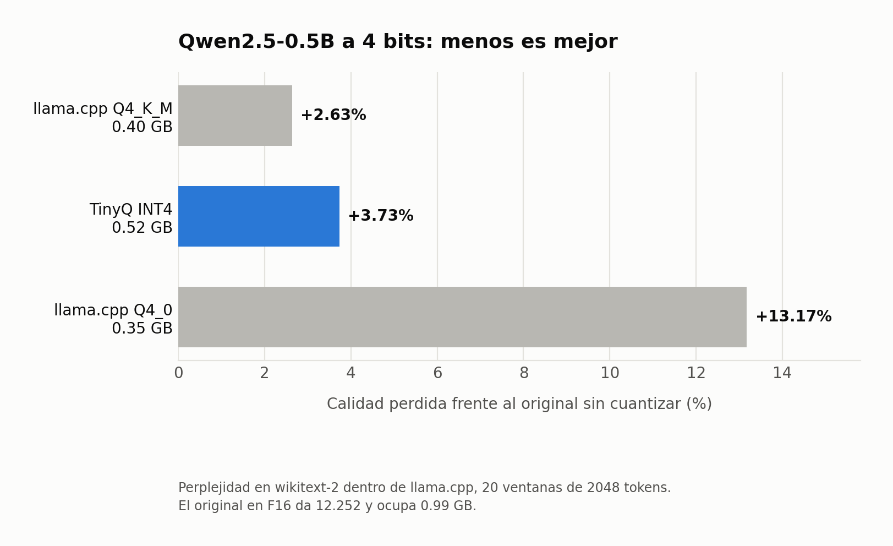

# Octuma contra los formatos de llama.cpp

Generado por `scripts/tabla_gguf.py`. Perplejidad en wikitext-2 test, 20 ventanas de 2048 tokens, **todo medido dentro de llama.cpp** con `llama-perplexity`.

Comparar perplejidades entre motores distintos no significa nada: cada uno trocea y promedia a su manera. Por eso el `.gguf` de Octuma se mide dentro de llama.cpp, contra los formatos de llama.cpp, sobre el mismo corpus. Lo que se compara es **cuanto pierde cada formato respecto al mismo original en F16**.

## Todos los modelos

| Modelo | Octuma INT4 | Q4_K_M | Q4_0 |
|---|---|---|---|
| Qwen2.5-0.5B | +3.73% | **+2.63%** | +13.17% |
| Qwen2.5-1.5B | **+2.11%** | +4.74% | +8.35% |
| Qwen2.5-3B | **+2.43%** | +6.21% | +11.02% |

En **negritas** el mejor de cada fila. Menos es mejor.

## Que dicen los numeros

**Octuma gana en 2 de 3 modelos.** La diferencia mas grande esta en Qwen2.5-3B: 2.43% contra 6.21% de Q4_K_M, **2.6 veces menos dano**.

**En Qwen2.5-0.5B pierde**: 3.73% contra 2.63% de Q4_K_M, y ademas ocupa mas (0.52 GB contra 0.40 GB). En los modelos mas chicos no hay razon para preferir Octuma sobre Q4_K_M.

**La tendencia importa mas que cualquier fila suelta.** Al crecer el modelo, Q4_K_M se degrada cada vez mas (2.63% → 4.74% → 6.21%) mientras Octuma se mantiene plano (3.73% → 2.11% → 2.43%). El cruce esta entre Qwen2.5-0.5B y Qwen2.5-1.5B.

Eso encaja con lo que ya media el barrido en PyTorch: entre mas grande el modelo, menos duele cuantizarlo bien. Y es el caso de uso que importa para la app Android, donde se corre el modelo mas grande que quepa.

A **Q4_0 le gana en los tres**, siempre por varias veces.

## Detalle por modelo

### Qwen2.5-0.5B



| Formato | Perplejidad | vs F16 | Tamaño | Compresion |
|---|---|---|---|---|
| F16 (original) | 12.2523 | — | 0.99 GB | — |
| llama.cpp Q4_K_M | 12.5750 | +2.63% | 0.40 GB | 2.50x |
| **Octuma INT4** | 12.7096 | +3.73% | 0.52 GB | 1.91x |
| llama.cpp Q4_0 | 13.8665 | +13.17% | 0.35 GB | 2.82x |

### Qwen2.5-1.5B


| Formato | Perplejidad | vs F16 | Tamaño | Compresion |
|---|---|---|---|---|
| F16 (original) | 8.3111 | — | 3.09 GB | — |
| **Octuma INT4** | 8.4864 | +2.11% | 1.32 GB | 2.34x |
| llama.cpp Q4_K_M | 8.7047 | +4.74% | 0.99 GB | 3.14x |
| llama.cpp Q4_0 | 9.0051 | +8.35% | 0.93 GB | 3.31x |

### Qwen2.5-3B


| Formato | Perplejidad | vs F16 | Tamaño | Compresion |
|---|---|---|---|---|
| F16 (original) | 7.3338 | — | 6.18 GB | — |
| **Octuma INT4** | 7.5118 | +2.43% | 2.40 GB | 2.57x |
| llama.cpp Q4_K_M | 7.7892 | +6.21% | 1.93 GB | 3.20x |
| llama.cpp Q4_0 | 8.1418 | +11.02% | 1.82 GB | 3.39x |

## Como reproducirlo

```bash
python scripts/make_wikitext_txt.py --out out/wikitext2.txt
python scripts/bench_gguf.py Qwen/Qwen2.5-3B-Instruct \
    --octuma out/qwen3b-int4-fix.gguf --slug qwen3b
python scripts/tabla_gguf.py && python scripts/grafica_gguf.py
```

`bench_gguf.py` baja el original, lo convierte a F16, lo cuantiza con llama.cpp y mide las cuatro variantes de una pasada.
